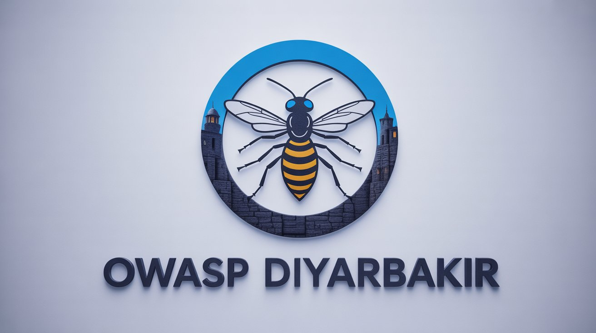

 

### 👋 Welcome to the OWASP Diyarbakir Chapter!

The OWASP Diyarbakir Chapter is an open and inclusive community dedicated to promoting awareness, education, and collaboration around software security in Southeastern Turkey.

Whether you're a developer, researcher, student, or cybersecurity enthusiast — you're welcome here. Our mission is to build a strong local ecosystem where people can learn, share, and grow together through meetups, workshops, CTFs, and open-source contributions.

We are currently building our core team and planning our first events. If you would like to join us, give a talk, or help organize local activities, please reach out — we’d love to hear from you!

Stay tuned for upcoming announcements!

— OWASP Diyarbakir Team

### Participation
The Open Worldwide Application Security Project (OWASP) is a nonprofit foundation that works to improve the security of software. All of our projects, tools, documents, forums, and chapters are free and open to anyone interested in improving application security. 

Chapters are led by local leaders in accordance with the [Chapters Policy](/www-policy/operational/chapters). Financial contributions should only be made online using the authorized online donation button. 

Everyone is welcome and encouraged to participate in our [Projects](/projects/), [Local Chapters](/chapters/), [Events](/events/), [Online Groups](https://groups.google.com/a/owasp.com/), and [Community Slack Channel](https://owasp.slack.com/). We especially encourage diversity in all our initiatives. OWASP is a fantastic place to learn about application security, to network, and even to build your reputation as an expert. We also encourage you to be [become a member](/membership/) or consider a [donation](/donate/) to support our ongoing work.

### Next Meeting/Event

### Upcoming meetings

Please register for our next meeting at our [meetup group](https://www.meetup.com/owasp-diyarbak-chapter/).


